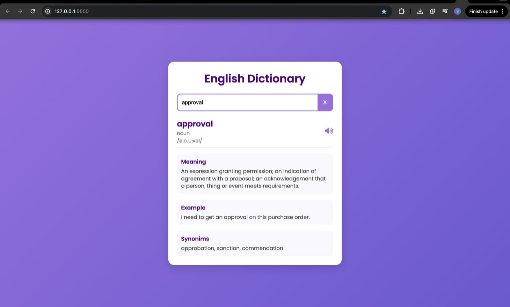

# 📚 English Dictionary Application

An interactive **English Dictionary Web App** built with **HTML**, **CSS**, and **JavaScript**.  
Users can type any word, press Enter, and instantly get:

- ✅ Meaning  
- ✅ Synonyms  
- ✅ Example sentence  
- ✅ Phonetic transcription  
- ✅ Part of speech (e.g., adjective, noun)  
- ✅ Pronunciation audio (click the speaker icon to listen)

The app fetches data from the free **[Dictionary API](https://dictionaryapi.dev/)**.

---

## 🚀 Features

- **🔍 Search Functionality** — Enter any English word to fetch details.  
- **📖 Word Details** — Displays:
  - Word
  - Part of Speech
  - Phonetic transcription
  - Meaning
  - Example usage
  - Synonyms list
- **🔊 Audio Pronunciation** — Click the speaker icon to listen to the word.
- **❌ Clear Search** — One-click clear button to reset the search box.
- **📱 Responsive Design** — Works smoothly on mobile, tablet, and desktop.
- **🎨 Modern UI** — Clean, elegant design with gradient backgrounds and smooth hover effects.

---

### 📌  Result 


---

## 🛠️ Technologies Used

- **HTML5** — For structuring the content.
- **CSS3** — For styling and responsiveness.
- **JavaScript (Vanilla JS)** — For interactivity and API calls.
- **Font Awesome** — For the speaker icon.
- **Google Fonts (Poppins)** — For modern typography.
- **[Dictionary API](https://dictionaryapi.dev/)** — Free API for word meanings.

---

## 📂 Project Structure

```plaintext
dictionary-app/
│
├── index.html        # Main HTML structure
├── style.css         # Styling for the UI
├── script.js         # JavaScript logic for fetching and displaying data
└── screenshots/      # Screenshots for the README
